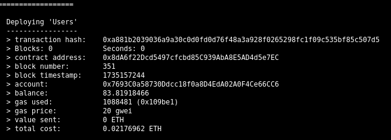

# Land Registration System Using Blockchain


## Table of Contents

- [About](##About)
   - [How it works](###how-it-works)
- [Tech Stack & Tools](##tech-stack--tools)
- [Key Features](##key-features)
- [Setup](##Setup)
- [Running the Code](#usage)


## About

The Land Registration System Using Blockchain is a decentralized application (DApp) built on the Ethereum blockchain. 
It aims to revolutionize the traditional land registration process by leveraging blockchain technology. 

### Drawbacks of the traditional system
 
   *  Traditional system prone to fraud and manipulation.   
   *  Slow and cumbersome process for property tranfer.
   *  Manual paperwork leads to inefficiencies and delays.
   *  Lack of transparency in property ownership records.     
   *  Involvment of third parties in the process of purchase increases the costs.
   *  Difficulty in resolving disputes due to centralized control.
   *  Risk of data loss or corruption in centralized databases.

### How it works ?

This project contains mainly two steps:

1. **Decentralizing Land Registry data**:
   
   - In order to leverage blockchain technology to avoid drawbacks of the traditional system, we first need to decentrailze the property ownership data that is held by their respective government.
   
    - To decentralize the data, we have provided an option in the portal to the user for uploading their property details & documents as a proof to identify the ownership of the user.

    - Once the user has uploaded their documents, they should be verified by the respective government officer.
   
   - After the verification process is completed, if he/she is the legal owner of the property then officer will grants the ownership to the user or else they will reject it.

   - Once, after the approval of ownership, the property details & it's ownership details  will be stored in the blockchain.

   - Later, user can buy or sell a property from or to a person without involvment of any middlemen or any other problems of the traditional system that slows down the process.

2. **Ownership Transfer System**:
   - In order to sell the property to another person, user will **log into the land registry portal** using their credentials, there all the properties of the user are listed.

   - If the user wants to sell a particural property they can **make the property as available to sell for the price they wanted**.

   - Once, the user make their property available to sell, it is listed in a public page where **any interested buyer can send the purchase request to the owner with the price they want to offer**.

   - Owner can view all the purchase requests received to a particual property and **can accept the purchase request of a buyer**.

   - Later, buyer can **transfer the agreed payment amount** to the seller.

   - After the successfull payment transfer, the **ownership of the propery will be transferred** from the seller to the buyer.


## Tech Stack & Tools
```
* Flask==2.2.3 
* MongoDB
* Solidity
* Ethereum Blockchain
* Truffle
* Ganache
* Metamask
```

## Key Features:

- **Auction System**: Landowners can list their properties for sale and set their desired price through an auction mechanism.
- **Global Visibility**: Properties available for sale are visible to all users worldwide, allowing interested buyers to view and make offers.
- **Buyer Interaction**: Prospective buyers can submit buy requests with their offer prices, initiating the negotiation process.
- **Seller Decision-Making**: Landowners have the flexibility to review buy requests and select preferred buyers and offered prices.
- **Secure Transaction**: Upon acceptance of the transfer/buying proposal, buyers send Ether coins as payment, and ownership is seamlessly transferred.

## Setup

Follow these steps to set up the LandLedger project on your system:

### 1. Clone the Repository
```bash
git clone https://github.com/ATESAM-ABDULLAH/LandLedger.git/
cd LandLedger
```

### 2. Python Dependencies
Create a virtual environment and install the required Python packages:
```bash
sudo apt install python3-venv
python3 -m venv env
source env/bin/activate
```

### 3. Install Extra Base Modules
Install additional system dependencies:
```bash
sudo apt install pkg-config libfuse-dev curl
```

### 4. Install Required Python Packages
Redo the package installation:
```bash
pip install -r requirements.txt
```

### 5. Install Node.js and npm
Ensure Node.js and npm are installed:
```bash
sudo apt install nodejs npm
```

### 6. Update Node.js to Stable Version
```bash
npm install n -g
n stable
# Restart the terminal to verify the updated Node.js version
node -v
```

### 7. Install Truffle and Ganache
Install Truffle and Ganache CLI globally:
```bash
sudo npm install -g truffle ganache-cli
```

### 8. Install MongoDB
Replace `jammy` with your Ubuntu version in the following commands:
```bash
curl -fsSL https://www.mongodb.org/static/pgp/server-8.0.asc | sudo gpg -o /usr/share/keyrings/mongodb-server-8.0.gpg --dearmor
echo "deb [ arch=amd64,arm64 signed-by=/usr/share/keyrings/mongodb-server-8.0.gpg ] https://repo.mongodb.org/apt/ubuntu jammy/mongodb-org/8.0 multiverse" | sudo tee /etc/apt/sources.list.d/mongodb-org-8.0.list
sudo apt update
sudo apt-get install -y mongodb-org
```

### 9. Install and Setup MetaMask Browser Extension


## Running the Code

Follow these steps to run the LandLedger application:

### 1. Start Ganache
Run Ganache in a separate terminal:
```bash
ganache-cli --networkId 5777
```

### 2. Setup Accounts
#### Admin Account
1. Assign Ganache account `{0}` as the contract admin.
2. Update the `"Address_Used_To_Deploy_Contract"` field in `Server_For_Revenue_Dept/config.json` with the private key of Ganache account `{0}`.
3. Import this account as a new account in MetaMask.

#### Other Accounts
1. Assign Ganache accounts `{1}`, `{2}`, and `{3}` to roles: Seller, Buyer, and Employee_1.
2. Import these accounts as new accounts in MetaMask using their respective private keys.

### 3. Migrate Smart Contracts
Navigate to the `Smart_contracts` directory and migrate contracts:
```bash
cd Smart_contracts
truffle migrate
```

### 4. Start MongoDB
Run MongoDB in a separate terminal:
```bash
sudo systemctl start mongod
mongosh
```

### 5. Run the Application
#### Server for Users
```bash
cd Server_For_Users
python3 app.py
```

#### Server for Revenue Department
```bash
cd Server_For_Revenue_Dept
python3 app.py
```


## Screen shorts:
<br>
  
  
  
  
  
  
  
  
  
  
  



